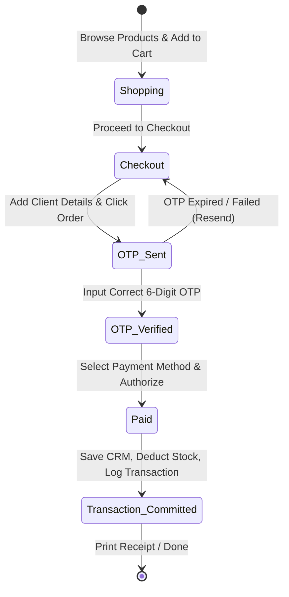

# Data Model: Jewellery Shop POS & E-Commerce System

## Entities

### 1. Product
Represents a jewelry item in the shop's catalog.

* **Attributes**:
  - `id`: String (Unique identifier, e.g., `prod-001`)
  - `name`: String (Display name of the product)
  - `category`: String (Category: `"Rings"`, `"Necklaces"`, `"Bracelets"`, `"Earrings"`)
  - `weightGrams`: Number (Weight of metal in grams)
  - `makingChargePerGram`: Number (Making charge cost per gram)
  - `stoneValue`: Number (Flat cost of any precious stones/diamonds embedded)
  - `imageUrl`: String (URL or path to product image mockup)
  - `stockCount`: Number (Available inventory)

* **Validation Rules**:
  - `weightGrams` MUST be greater than `0`.
  - `makingChargePerGram` and `stoneValue` MUST be greater than or equal to `0`.
  - `stockCount` MUST be greater than or equal to `0`.

---

### 2. Client
Represents a customer's record stored in the shop CRM.

* **Attributes**:
  - `id`: String (Primary key, maps to customer's validated Phone Number)
  - `name`: String (Full name of client)
  - `email`: String (Email address)
  - `phone`: String (Unique phone number used for SMS OTP)
  - `tags`: Array of Strings (List of classification tags, e.g., `["VIP", "Wants Rings"]`)
  - `createdDate`: String (ISO 8601 creation timestamp)

* **Validation Rules**:
  - `phone` MUST be a valid 10-digit number.
  - `email` MUST be formatted correctly.
  - Tags must not contain special characters.

---

### 3. Employee
Represents a shop sales staff member.

* **Attributes**:
  - `id`: String (Unique identifier, e.g., `emp-101`)
  - `name`: String (Full name of staff)
  - `role`: String (Role: `"Sales Associate"`, `"Manager"`)
  - `maxDiscountLimit`: Number (Maximum discount percentage allowed, e.g. `10.00`)
  - `salesTotal`: Number (Cumulative currency amount of sales completed)
  - `commissionEarned`: Number (Calculated commission based on role rate)

* **Validation Rules**:
  - `maxDiscountLimit` MUST be between `0.00` and `100.00`.
  - `salesTotal` and `commissionEarned` must start at `0`.

---

### 4. Transaction
Represents a completed sale (either online customer checkout or employee POS sales checkout).

* **Attributes**:
  - `id`: String (Unique invoice number, e.g., `INV-20260523-0001`)
  - `clientId`: String (ID of the purchaser Client)
  - `employeeId`: String (ID of the staff who executed the sale; `null` for direct online e-commerce checkout)
  - `items`: Array of Objects:
    - `productId`: String
    - `weightGrams`: Number
    - `quantity`: Number
    - `liveRate`: Number (Gold rate/gram used at transaction time)
    - `price`: Number (Calculated item price before transaction discount)
  - `subtotal`: Number (Sum of item prices)
  - `discountApplied`: Number (Discount percentage, e.g., `5.00`)
  - `taxRate`: Number (Tax percentage applied)
  - `totalAmount`: Number (Final customer cost: `(subtotal * (1 - discount/100)) * (1 + taxRate/100)`)
  - `paymentMethod`: String (`"Card"`, `"Cash"`, `"Bank Transfer"`)
  - `timestamp`: String (ISO 8601 transaction completion timestamp)

* **Validation Rules**:
  - If `employeeId` is present, `discountApplied` MUST NOT exceed the referenced Employee's `maxDiscountLimit`.
  - `totalAmount` MUST match the calculation exactly.

---

### 5. SystemSettings (Singleton)
Global configurations.

* **Attributes**:
  - `liveGoldRatePerGram`: Number (Current price of gold per gram, e.g. `85.00`)
  - `defaultTaxRate`: Number (Percentage, e.g. `18.00`)
  - `adminPassword`: String (For setting limits, defaults to `"admin123"`)
  - `employeePassword`: String (For employee POS entry, defaults to `"gold123"`)

---

## State Transitions

