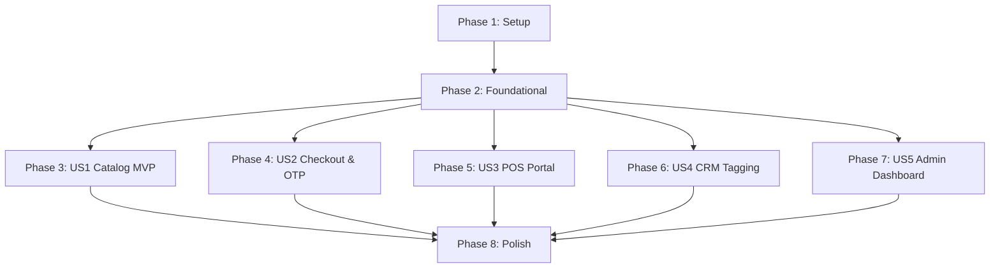

# Tasks: Jewellery Shop POS & E-Commerce System

**Input**: Design documents from `/specs/001-jewellery-shop-system/`

**Prerequisites**: plan.md (required), spec.md (required), research.md, data-model.md, contracts/

**Tests**: Unit tests are integrated directly into the browser suite (`js/tests.js`) to verify pricing algorithms, database constraints, and discount controls.

---

## Phase 1: Setup (Shared Infrastructure)

**Purpose**: Project initialization and basic structure.

- [ ] T001 Create project file structure including index.html, css/styles.css, js/repository.js, js/app.js, and js/tests.js
- [ ] T002 [P] Configure basic gold theme style design variables and typography in css/styles.css

---

## Phase 2: Foundational (Blocking Prerequisites)

**Purpose**: Core infrastructure that must be complete before any user stories can be implemented.

**⚠️ CRITICAL**: No user story work can begin until this phase is complete.

- [ ] T003 Implement DataRepository localStorage access model and initialization flags in js/repository.js
- [ ] T004 [P] Implement PriceCalculator formula and dynamic calculations matching Core Principle II in js/repository.js
- [ ] T005 [P] Implement OTPService random generator and on-screen Toast alerts simulator matching Core Principle III in js/repository.js

---

## Phase 3: User Story 1 - Customer Product Browsing & Shopping (Priority: P1) 🎯 MVP

**Goal**: Enable customer navigation, category filtering, product search, and detail modal with dynamic gold rate pricing.

**Independent Test**: Customer can open index.html, filter rings, search for items, see live gold rate calculations, and add items to a shopping cart.

### Tests for User Story 1
- [ ] T006 [P] [US1] Implement unit tests for dynamic pricing formula calculations and cart item summing in js/tests.js

### Implementation for User Story 1
- [ ] T007 [P] [US1] Populate Product catalog mock seed dataset and product schemas in js/repository.js
- [ ] T008 [US1] Create Product Grid rendering view and Category/Search filters in js/app.js
- [ ] T009 [US1] Implement Shopping Cart Drawer overlay, count indicator, and dynamic price summary UI in js/app.js

---

## Phase 4: User Story 2 - Secure Customer Checkout with OTP (Priority: P1)

**Goal**: Authorize customer shopping cart submission using customer data form and 6-digit OTP verification.

**Independent Test**: Customer triggers checkout, inputs phone details, receives on-screen OTP notification toast, enters correct code, and completes order transaction.

### Tests for User Story 2
- [ ] T010 [P] [US2] Implement unit tests for transaction state transitions, inventory deduction, and OTP expiration in js/tests.js

### Implementation for User Story 2
- [ ] T011 [US2] Create Checkout view panel with customer contact details inputs (Name, Phone, Email) in js/app.js
- [ ] T012 [US2] Implement Transaction save transaction database operations and Product stock decrement logic in js/repository.js
- [ ] T013 [US2] Build verification modal overlay, countdown timer, and correct OTP validation submit triggers in js/app.js

---

## Phase 5: User Story 3 - Employee POS Portal with Strict Discount Limits (Priority: P2)

**Goal**: Create an employee portal to execute in-store sales checkout enforcing strict discount cap gates.

**Independent Test**: Employee enters portal with code "gold123", selects items, applies 5% discount (below limit), and checkout works. Applying 15% discount (over limit) displays a rejection alert.

### Tests for User Story 3
- [ ] T014 [P] [US3] Implement unit tests validating that discounts exceeding employee limits are strictly blocked at the repository logic layer in js/tests.js

### Implementation for User Story 3
- [ ] T015 [US3] Create Employee Portal view switcher and access code verification toggle in js/app.js
- [ ] T016 [US3] Implement Employee direct-sale checkout builder (Client lookup, Cart selector, dynamic price display) in js/app.js
- [ ] T017 [US3] Integrate strict repository checks to compare applied discount percentages against employee cap variables in js/repository.js

---

## Phase 6: User Story 4 - CRM Client Tagging (Priority: P2)

**Goal**: Log customer contact profile and provide interactive tagging (e.g. VIP, Wants Rings) visible in CRM dashboard.

**Independent Test**: Employee clicks customer profile, adds a tag, tag is saved and remains on reload.

### Tests for User Story 4
- [ ] T018 [P] [US4] Implement unit tests to verify Client tag CRUD functions and tag duplication prevention in js/tests.js

### Implementation for User Story 4
- [ ] T019 [US4] Create Client database repository query endpoints and tag serialization saves in js/repository.js
- [ ] T020 [US4] Build CRM Customers List directory dashboard view for employees in js/app.js
- [ ] T021 [US4] Implement interactive tag editing chips (Add/Remove tags) on customer details pages in js/app.js

---

## Phase 7: User Story 5 - Admin Dashboard (Priority: P3)

**Goal**: Enable shop administrators to set employee discount caps, update live gold rates, and view employee sales logs.

**Independent Test**: Admin inputs "admin123" code, changes gold rate, ring prices recalculate.

### Tests for User Story 5
- [ ] T022 [P] [US5] Implement unit tests for live gold rate adjustments, employee limit overrides, and authentication gates in js/tests.js

### Implementation for User Story 5
- [ ] T023 [US5] Build Admin Login screen view and dashboard workspace layout in js/app.js
- [ ] T024 [US5] Implement Admin Gold Rate update forms and Employee max discount limit adjusters in js/app.js
- [ ] T025 [US5] Create Employee Sales leaderboard analytics overview panel in js/app.js

---

## Phase 8: Polish & Cross-Cutting Concerns

**Purpose**: Refinement of styles, print views, and overall user flow validation.

- [ ] T026 Implement a print-friendly HTML/CSS Invoice/Receipt generator triggered on transaction success in index.html
- [ ] T027 [P] Polish CSS styles for glassmorphism, responsive grid overlays, and mobile viewports in css/styles.css
- [ ] T028 Build a dedicated floating UI Test Panel in index.html that triggers and renders result details from js/tests.js

---

## Dependencies & Execution Order



### Parallel Execution Guidelines
* **T002 (Setup Styles)** can run in parallel with **T001 (Files Setup)** once the folder is created.
* **T004 (Pricing)** and **T005 (OTP)** can be implemented concurrently within the Foundational phase.
* Once Phase 2 (Foundational) is complete:
  - Teams can split implementation of user stories (e.g. Developer A works on **US1/US2**, Developer B works on **US3/US4**, Developer C works on **US5**).
  - All test files marked `[P]` within each story phase can be authored in parallel with model mock designs.

---

## Parallel Example: User Story 1
```powershell
# Create dynamic pricing unit test assertions:
# Task T006 -> js/tests.js

# Setup catalog mock data arrays:
# Task T007 -> js/repository.js
```

---

## Implementation Strategy

### MVP First (User Story 1 & 2 Only)
1. Complete Setup and Foundational constraints.
2. Complete User Story 1 (Browsing and Catalog shopping).
3. Complete User Story 2 (Cart checkout + OTP code validation).
4. **Checkpoint**: Customer can navigate, add to cart, verify OTP, and checkout. Validate this flow before adding employee POS features.

### Incremental Delivery
1. Customer checkout portal goes live (MVP).
2. Add Employee portal (US3) so staff can checkout orders from store floor.
3. Add CRM controls (US4) to track customer tagging.
4. Add Admin Dashboard (US5) to modify global rate pricing and limits.
